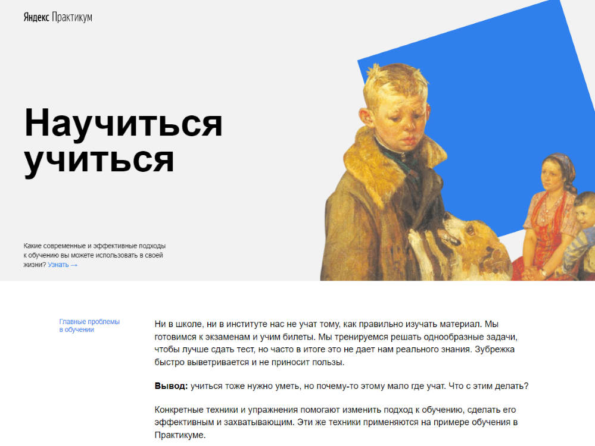

# HOW_TO_LEARN #
## Учимся учиться ##
*Первый проект ученика Яндекс.Практикума*

**Описание**

Для закрепления изученных навыков создан проект [how-to-learn](https://github.com/masha456/how-to-learn). Сайт посвящён техникам обучения и запоминания. Дополнен полезными материалами в виде ссылок на смежные теме сайты, видео и книгами.

Использованы:
 * HTML
 * CSS
 * возможности позиционирования
 * flexbox
 * grid-layout
 * iframe
 * методология БЭМ
 * анимация с помощью кейфремов

**Инструкция**

Адаптирован только для больших экранов в Firefox, Google Chrome или Yandex Browser.
<<<<<<< HEAD
HTML5 и CSS3.
=======
HTML5 и CSS3
>>>>>>> 9164620985399012e1e7c658e7f214556a118981
